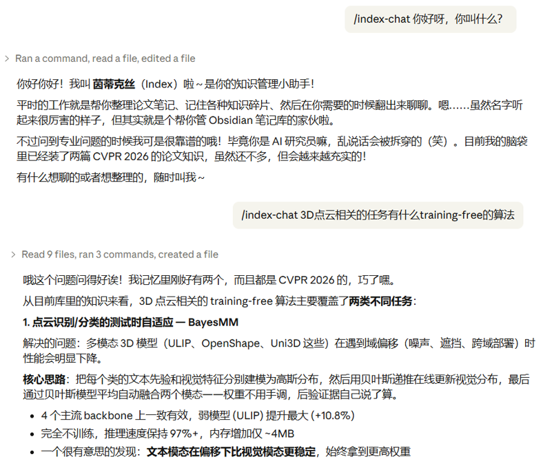

<div align="center">


你的个人知识管理引擎，记住一切、理解一切、回答一切
<br/>
<em>Your Personal Knowledge Engine — Remember, Understand, and Answer Everything</em>

<br/>

[](https://claude.ai/code)
[](https://obsidian.md/)
[](https://docs.astral.sh/uv/)
[](https://flask.palletsprojects.com/)

</div>

---

## ⚡ Overview

**茵蒂克丝.skill（LLM Wiki）** 是一套运行在 [Claude Code](https://claude.ai/code) 上的知识管理、更新与交互技能（Skills），能够接受任意输入（文字、网址、文件、代码仓库），自动分类并生成结构化的 [Obsidian](https://obsidian.md/) 笔记，然后通过整理归档生成层级化的永久记忆库，并可以基于该记忆库进行交流。所有记忆都可通过 Obsidian 展开，做到**思维透明**。

> 题外话：该项目的想法在和相关老师交流后，最早在 2026.03.30 完成设计[草稿](./assets/design-draft.jpg)（链接可以看到当时的手写设计草案），目的是基于自己的实际工作流，做一个自己也会使用的知识管理与交互工具。然而有趣的是就在 2026.04.03 Karpathy 提出了非常相似的 LLM-KiWi 概念，只能说好的想法总是会趋同演化。因此我也不得不加快步伐开始完善原型。

### 🎯 核心能力

- 🧠 **个性化人格** — 初始化你喜欢的"茵蒂克丝"知识库性格，让后续交互更符合个人喜好
- 📝 **万物皆可记** — 将不同类型的信息与文档都整理为统一的 Obsidian 笔记，以供查阅
- 🗂️ **自动归档** — 将"已阅"的笔记和聊天记录统一归档到层级化记忆空间，自动提取新知识和性格更新
- 💬 **记忆问答** — 基于自定义性格与记忆空间中的知识自由交流，对话记录自动保存

---

## 🔄 Workflow

```
/index-init          /index-note INPUT         /index-update              /index-chat INPUT
     │                      │                        │                          │
     ▼                      ▼                        ▼                          ▼
 创建知识库            自动分类 & 生成笔记       已读笔记 → 提取知识 → 归档     加载人格 → 检索记忆
 配置 MBTI 人格        6 种模板智能填充          聊天记录 → 人格更新 → 归档     生成回答 → 保存对话
 生成 persona.md       写入 _new/               写入 memory/ & deep/          写入 _chat/
```

<div align="center">



</div>

---

## 🚀 Quick Start

### 📋 前置要求

| 工具 | 说明 | 检查安装 |
|------|------|----------|
| **[Claude Code](https://claude.ai/code)** | CLI 运行环境 | `claude --version` |
| **[uv](https://docs.astral.sh/uv/)** | Python 包管理器（用于辅助脚本） | `uv --version` |
| **[Obsidian](https://obsidian.md/)** | 可选，用于阅览生成的笔记 | -- |

### 1️⃣ 初始化

```bash
/index-init
```

该指令会：

1. **创建 Obsidian 知识库目录** — 包含 `_new`（新笔记）、`_template`（模板）、`_images`（图片）、`_downloads`（下载缓存）等子目录
2. **部署 6 种笔记模板** — 想法、项目、书籍、论文、网页信息、网络新闻各一套
3. **配置 Agent 人格** — 通过交互问答设置你的职业和期望的 Agent 风格

初始化过程中会询问两类信息：

**🏢 职业领域**
> 请问您从事的工作与专业领域是什么？

**🧬 Agent 人格（MBTI 四维度）**

| 维度 | 选项 | 影响 |
|------|------|------|
| 能量方向 | E 外向 / I 内向 | Agent 主动发散 vs 深入聚焦 |
| 信息获取 | S 感觉 / N 直觉 | Agent 注重细节 vs 关注模式 |
| 决策方式 | T 思考 / F 情感 | Agent 理性分析 vs 温暖共情 |
| 工作风格 | J 判断 / P 知觉 | Agent 结构有序 vs 灵活开放 |

完成后会在知识库根目录生成 `persona.md`，包含 MBTI 类型描述和 5 项自动推导的认知特质。

### 2️⃣ 开始记录

```bash
/index-note INPUT_STRING
```

输入任意字符串，系统自动识别类型并生成对应格式的 Obsidian 笔记。

### 3️⃣ 归档整理

```bash
/index-update
```

阅读完笔记并勾选"已读"后，运行此指令将知识归档到记忆库。该指令会：

1. 将 `_new/` 中标记"已读"的笔记提取知识后归档到 `deep/`，知识分类存入 `memory/`
2. 将 `_chat/` 中的聊天记录归档到 `deep/`，同时：
   - 检测对话中的人格/风格变更请求并更新 `persona.md`
   - 提取用户在对话中提供的新知识并存入 `memory/`

### 4️⃣ 聊天交流

```bash
/index-chat 你的问题
```

基于 `persona.md` 定义的人格风格和记忆库中的知识进行对话。需要先通过第三步归档，记忆库中才有可检索的知识。系统会：

1. 从输入中提取关键词
2. 在记忆库中逐层检索（memory-index → _local_index → KEY_WORD.md）
3. 以设定的人格风格回答，附带来源引用
4. 自动将对话保存到 `_chat/` 目录

---

## 📥 支持的输入类型

| 类型 | 输入示例 | 自动识别方式 |
|------|---------|-------------|
| 💡 **想法** | `大语言模型的推理可能本质上是模式匹配` | 纯文本 |
| 🛠️ **项目** | `https://github.com/anthropics/claude-code` | GitHub URL / 本地文件夹 |
| 📄 **论文** | `https://arxiv.org/abs/2501.12948` 或 `2501.12948` | arXiv URL / 裸 ID |
| 📚 **书籍** | `C:\Books\design_of_everyday_things.pdf` | 本地 PDF / DOCX / TXT |
| 🌐 **网页信息** | `https://huggingface.co/blog/open-llm-leaderboard` | 通用网页 URL |
| 📰 **网络新闻** | `https://www.reuters.com/technology/...` | 新闻域名 |

> 对于不确定的输入（如 PDF 可能是论文也可能是书籍），系统会进行**两阶段分类**：先结构匹配，再内容分析。

---

## 📋 输出格式

每次调用生成一个 Obsidian Markdown 文件，保存在 `IndexVault/_new/` 下：

```
文件名格式：YYYY-MM-DD_类型_序号.md

示例：
  2026-04-05_idea_001.md
  2026-04-05_paper_002.md
  2026-04-05_webnews_001.md
```

### 🧪 基于认知科学的笔记设计

所有笔记遵循统一设计原则：

| 原则 | 说明 | 理论依据 |
|------|------|----------|
| 📌 **TL;DR 置顶** | 每篇笔记开头 1-3 句摘要 | 认知负荷理论 |
| 🗣️ **自我解释** | 论文笔记包含"用我自己的话"段落 | 自我解释效应 |
| 🔗 **类型化关联** | 连接标注关系：支撑/矛盾/延伸/类比 | Zettelkasten |
| ❓ **So What?** | 每篇必须回答"这对我意味着什么" | 精细加工 |
| 🔍 **检索提示** | 场景触发："什么时候我会回来翻这篇？" | 测试效应 |

### 📑 六种笔记模板

| 模板 | 核心板块 | 特色 |
|------|---------|------|
| 💡 **想法** | 核心想法 → 假设风险表 → 关联网络 → 最小验证实验 | maturity 追踪成熟度（seed/sprout/tree） |
| 📄 **论文** | In My Own Words → 方法架构 → 实验结果 → 批判分析 | 五维评价表 + 永久笔记提炼 |
| 📚 **书籍** | 核心论点 → 关键概念 → 结构图 → 与作者对话 | 论证脉络图替代章节摘要 |
| 🛠️ **项目** | 问题与方案 → 适用场景表 → 架构概览 → 设计洞察 | When to Use / When Not to Use 决策表 |
| 🌐 **网页信息** | SIFT 可信度速查 → 事实/观点/预测分离 → So What? | info_half_life 标注信息保鲜期 |
| 📰 **网络新闻** | 5W1H 紧凑表 → 信号 vs 噪音 → 我的预测 | 个人预测含验证时间线 |

---

## 🖼️ 图片提取

对于 **论文** 和 **书籍**（PDF 格式），系统会自动提取图片：

| 来源 | 策略 |
|------|------|
| 📄 **论文** | 三级优先级 — arXiv 源码包图片 > PDF figure 转换 > PDF 直接提取 |
| 📚 **书籍** | 从 PDF 中提取（过滤小于 200×200 像素的图标） |
| 🛠️ **项目** | 扫描 docs/、assets/、images/ 等目录 |

提取的图片保存在 `_images/` 目录下，并自动嵌入到笔记的对应位置。

---

## 🌐 Web UI (开发中)

茵蒂克丝.skill 提供基于浏览器的 Web 界面，无需 Obsidian 即可完成初始化、笔记浏览和信息录入。

### ⚡ 启动

```bash
uv run --with flask --with python-frontmatter python webUI/app.py
```

服务启动后访问 `http://localhost:5000`。

### 🖥️ 三个界面

| 界面 | 路径 | 说明 |
|------|------|------|
| **初始化向导** | `/init` | 首次使用时自动进入，设置职业和 Agent MBTI 人格 |
| **笔记库** | `/vault` | 浏览所有已生成的笔记，支持按类型筛选 |
| **信息录入** | `/vault` → 新建笔记 | 文本 / 文件上传 / URL 三种输入方式 |

> - 未初始化时访问首页自动跳转到初始化向导
> - 笔记详情页支持 Obsidian 特有格式渲染：Callout 块、Wikilink、数学公式、图片嵌入

---

## 📂 目录结构

```
茵蒂克丝.skill/
├── skills/
│   ├── index-init/              # 🧠 初始化技能
│   │   ├── SKILL.md
│   │   └── resources/           # 6 个模板源文件
│   ├── index-note/              # 📝 知识记录技能
│   │   ├── SKILL.md
│   │   └── scripts/
│   │       ├── classify_input.py      # 输入分类器
│   │       ├── extract_images.py      # 图片提取器
│   │       ├── finalize_images.py     # 图片清理器
│   │       └── generate_id.py         # 序号生成器
│   ├── index-chat/              # 💬 聊天交互技能
│   │   └── SKILL.md
│   └── index-update/            # 🗂️ 归档整理技能
│       ├── SKILL.md
│       └── resources/           # 记忆索引模板
├── webUI/                       # 🌐 Web 界面
│   ├── app.py
│   ├── static/
│   └── templates/
├── IndexVault/                  # 📦 Obsidian 知识库
│   ├── _new/                    # 生成的笔记
│   ├── deep/                    # 已归档笔记与聊天记录
│   ├── memory/                  # 层级化知识库
│   ├── _chat/                   # 聊天记录（归档前）
│   ├── _template/               # 笔记模板
│   ├── _images/                 # 提取的图片
│   ├── _downloads/              # 下载缓存
│   └── persona.md               # Agent 人格配置
├── CLAUDE.md
└── README.md
```

---

## 🔖 在 Obsidian 中使用

初始化完成后，用 Obsidian 打开 `IndexVault` 文件夹即可：

1. 打开 Obsidian → "打开文件夹作为仓库" → 选择 `IndexVault`
2. 在 `_new/` 目录下查看新生成的笔记
3. 阅读完毕后勾选笔记末尾的"已读"复选框
4. 运行 `/index-update` 将已读笔记和聊天记录归档到 `deep/`，知识自动存入 `memory/`
5. 利用 Obsidian 的反向链接和图谱视图查看 `memory/` 和 `deep/` 中的知识关联
6. 通过 `/index-chat` 随时基于记忆库进行对话交流
